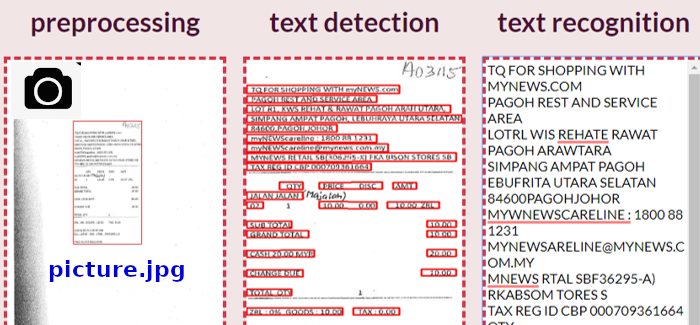
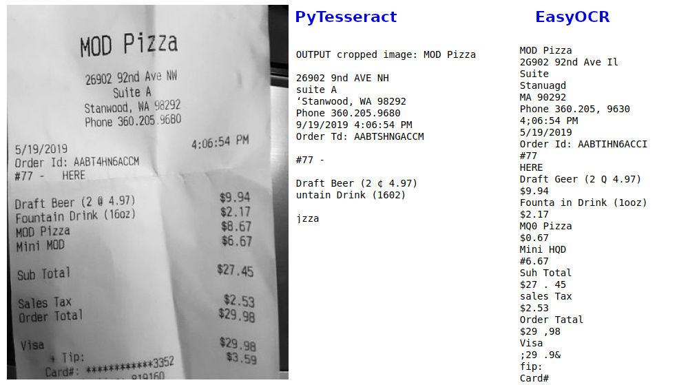

# Receipts optical character reading: Pytesseract vs. EasyOCR.

Details available as [blog post](https://m-berta.medium.com/optical-character-recognition-ocr-pytesseract-vs-easyocr-5df810c6c91c).

## 1. Background
Receipts carry the information needed for trade to occur between companies and much of it is on paper or in semi-structured formats. Traditionally this has been achieved by manually extracting the relevant information and inputting it into a database which is a labor-intensive and expensive process.Extracting key information from receipts and converting them to structured documents can serve many applications and services, such as efficient archiving, fast indexing and document analytics. Alas, we can take a picture of the receipt and the first task to accomplish the information extraction is to cast the characters and digits into a text file. For this task there are open-source packages available. The most common is Tesseract, often used together with the image-processing package OpenCV. These are tested and compared to a newer Python library, EasyOCR.

## 2. The data
200 images of restaurants/bars receipts were downloaded at the following [link](https://expressexpense.com/large-receipt-image-dataset-SRD.zip)

## 3. OCR libraries test results

Both packages have been tested on a Jupyter notebook running on Google Colabs.
Code is available [here](https://github.com/opsabarsec/Receipts-OCR-on-colabs/blob/main/OCR_Receipts.ipynb) . 

Pytesseract runs well just using CPU but often does not produces accurate outputs due to focus/shadows issues of the original image.
I have tried preprocessing using OpenCv but that helped moderately.

Better results were obtained using the EasyOCR library. It requires GPU accelerated environment though and runs smoothly when this is activated in a Colabs notebook.

